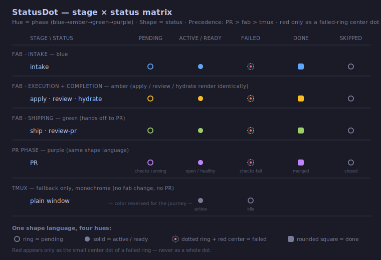

# Status Dot — Lifecycle Color Journey

> The single status dot reused on the sidebar window row, the dashboard window cards, and the
> pane-panel header. It encodes a window's place in the fab → PR lifecycle using **two orthogonal
> visual channels**: **hue = phase** (where in the journey) and **shape = status** (health). One
> learned shape language covers the entire pipeline.

Implementation: `app/frontend/src/components/status-dot.tsx` (rendering) +
`app/frontend/src/components/pr-status-line.tsx` (`statusDotState` / `fabPhase` / `fabShape` /
`prShape` / `PHASE_HUE`).

## Precedence — which input drives the dot

A window has up to three signals: a live **PR**, a **fab** pipeline stage, and **tmux** terminal
activity. Exactly one drives the dot, in this order:

```
PR  >  fab  >  tmux
```

1. **PR** drives when the window is change-bound AND has a PR (`win.fabChange && win.prNumber`).
2. **fab** drives when the window has a fab change (`win.fabChange`), using `fabStage` + `fabDisplayState`.
3. **tmux** activity drives a plain window (no fab change) — a monochrome fallback.

## Two axes — hue = phase, shape = status



### Hue = phase

The hue follows the fab-kit README's canonical **4-phase grouping** (Intake / Execution /
Completion / Shipping), then assigns **our own palette**. The README *grouping* is honored exactly —
`hydrate` stays its own "Completion" phase, not folded into Execution — but the *colors* differ:
**Execution and Completion both render amber**, **Shipping renders green**, and **purple is reserved
for the live PR phase**.

| README phase | Stage(s) | Hue token | Hex (ref) |
|--------------|----------|-----------|-----------|
| Intake | `intake` | `text-blue-400` | `#60a5fa` |
| Execution | `apply`, `review` | `text-amber-400` | `#fbbf24` |
| Completion | `hydrate` | `text-amber-400` | `#fbbf24` (same as Execution) |
| Shipping | `ship`, `review-pr` | `text-accent-green` | theme green |
| PR | the live PR | `text-purple-400` | `#c084fc` |
| (none) | plain window | `text-text-secondary` | gray |

> **Palette vs. README, not grouping.** Because Execution and Completion share amber, the rendered
> dot for `apply` / `review` / `hydrate` is identical — the 4-phase model is an internal refinement
> that aligns with fab-kit's canonical structure without changing any visible dot. This is a palette
> mapping, not a divergence.

### Shape = status

ONE shape vocabulary across **all** phases (fab stages AND PR):

| Status (`fabDisplayState` / PR equivalent) | Shape | Rendering |
|--------------------------------------------|-------|-----------|
| `pending` (PR: checks running) | ring | hollow circle, 1.8px solid border in phase hue, transparent fill |
| `active` / `ready` (PR: open / healthy) | solid circle | filled circle in phase hue |
| `failed` (PR: checks fail / changes requested) | **dashed ring + red center** | dashed 1.8px border in phase hue, transparent fill, with a small **red** (`bg-red-400`) dot centered inside |
| `done` (PR: merged) | rounded square | filled rounded square (`rounded-[3px]`) in phase hue |
| `skipped` (PR: closed unmerged) | gray ring | hollow ring forced to gray (`text-text-secondary`) |

The `failed` and `done` shapes render slightly larger (8px vs the 6px ring/solid) so the dashed
border shows enough dashes (with a clearly visible red center) and the square reads unambiguously as
a square next to the circles.

### tmux fallback

The lowest-precedence plain-window signal is **monochrome gray** — color is reserved for the fab/PR
journey:

- `active` → gray solid circle
- `idle` → gray hollow ring

## Full matrix (rows = stage/phase, cols = status)

| Stage (hue) | pending | active/ready | failed | done | skipped |
|-------------|---------|--------------|--------|------|---------|
| intake (blue) | blue ring | blue solid | blue dashed-ring + red center | blue square | gray ring |
| apply/review/hydrate (amber) | amber ring | amber solid | amber dashed-ring + red center | amber square | gray ring |
| ship/review-pr (green) | green ring | green solid | green dashed-ring + red center | green square | gray ring |
| PR (purple) | purple ring (checks pending) | purple solid (open/healthy) | purple dashed-ring + red center (failing) | purple square (merged) | gray ring (closed) |
| plain (gray) | — | gray solid (active) | — | — | gray ring (idle) |

## Red is used in exactly one way

Across the entire system, **red appears only as the small center dot inside a `failed` dashed
ring** — never as a whole-dot color. This deliberately removes two earlier special cases:

- the merged `StatusDot`'s `fabDisplayState === "failed"` whole-dot red tint, and
- the old PR dot's solid-red `fail` state.

Both now render as a **dashed ring in their phase hue + a red center dot**.

## Accessibility

Every dot carries `role="img"` + `aria-label` + `title` composed from **phase + status**, so color
is never the sole channel (colorblind a11y + the keyboard-first constitution). Examples:
`"apply — active"`, `"review — failed"`, `"intake — pending"`, `"PR — merged"`; the tmux fallback
uses the bare `"active"` / `"idle"`.

## Scope notes

- **Frontend only.** All inputs already flow on `WindowInfo` via SSE (`fabChange`, `fabStage`,
  `fabDisplayState`, `activity`, and the PR fields). No backend / API / SSE / tmux change.
- The existing PR color vocabulary (`PR_STATE_COLORS`, `PR_CHECKS_COLORS`, `PR_REVIEW_COLORS`,
  `prDotState`, `PrStatusLine`) is preserved unchanged — it serves the dashboard PR line and the
  pane-panel PR segments. This spec governs the **dot** only.

*Introduced by change `260615-0hsz-status-dot-lifecycle-journey`, extending the unified StatusDot
(`260615-yg7f-unified-status-dot`).*
